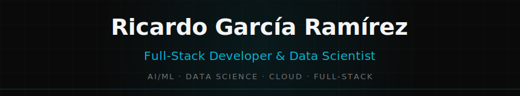
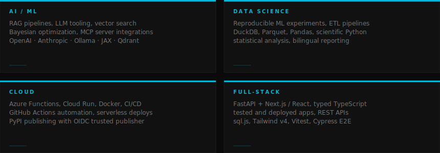
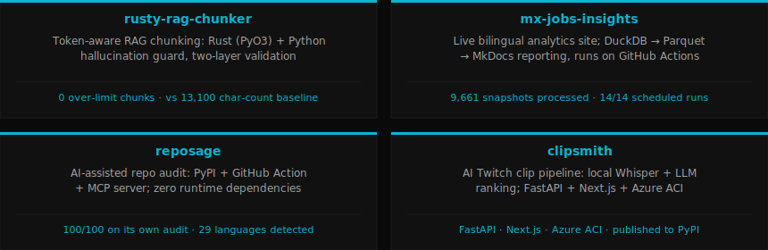

M.Sc. Data Science. 7+ years enterprise engineering. Open to select freelance projects in Python pipelines, RAG, and ML tooling.

---

## What I Build

---

## Tech Stack

---

## Featured Work

[rusty-rag-chunker](https://github.com/ricardogr07/rusty-rag-chunker) &nbsp;·&nbsp; [mx-jobs-insights](https://github.com/ricardogr07/mx-jobs-insights) &nbsp;·&nbsp; [reposage](https://github.com/ricardogr07/reposage) &nbsp;·&nbsp; [clipsmith](https://github.com/ricardogr07/clipsmith)

---

## Published Packages

7 packages on PyPI

- [LinkedInWebScraper](https://pypi.org/project/LinkedInWebScraper/) — daily CI scraper with deduplication
- [RepoSage](https://pypi.org/project/reposage/) — repo audit: 29 languages, 32 frameworks, optional LLM layer
- [clipsmith-ai](https://pypi.org/project/clipsmith-ai/) — AI-assisted Twitch clip pipeline
- [jax-bo](https://pypi.org/project/jax-bo/) — Bayesian Optimization library in JAX
- [MarketLab](https://pypi.org/project/marketlab/) — reproducible market-experiment platform
- [PurkinjeUV](https://pypi.org/project/purkinje-uv/) — cardiac Purkinje network geometry generator
- [Myocardial-Mesh](https://pypi.org/project/myocardial-mesh/) — cardiac simulation library

---

## Activity

<table>
  <tr>
    <td></td>
    <td></td>
  </tr>
</table>

---

[Portfolio](https://ricardogr07.github.io) &nbsp;·&nbsp; [LinkedIn](https://www.linkedin.com/in/ricardogr07) &nbsp;·&nbsp; [Email](mailto:rgr5882@gmail.com)
